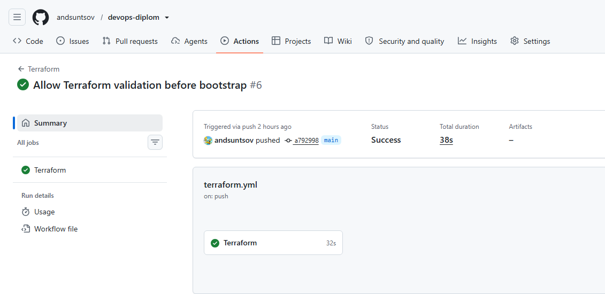
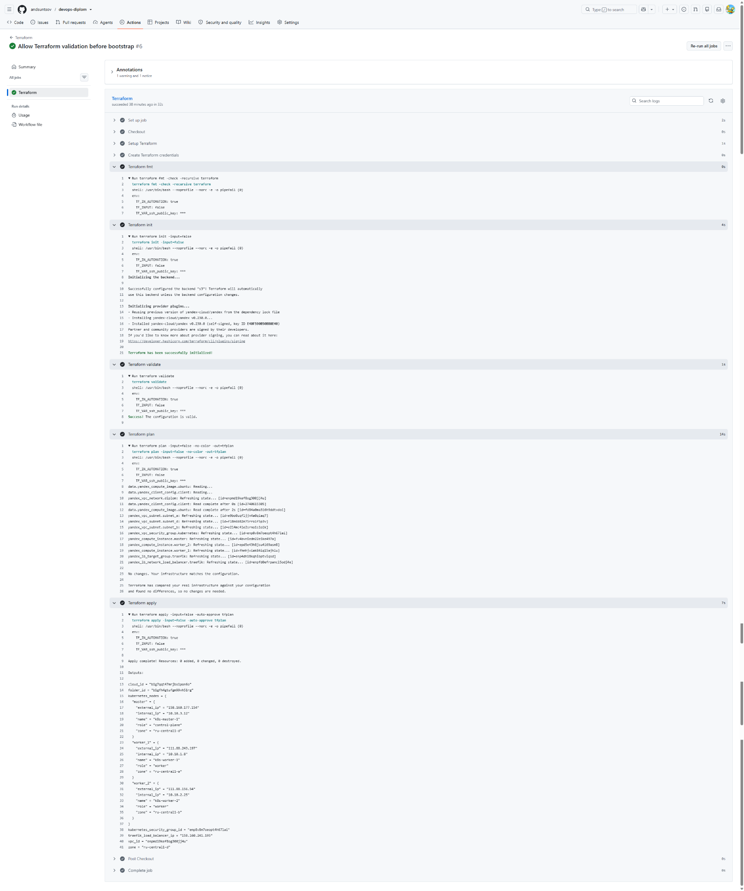

# DevOps Diplom

Дипломный проект по автоматизации развёртывания инфраструктуры, Kubernetes-кластера, мониторинга и CI/CD в Yandex Cloud.

## 1. Terraform

Основной репозиторий:

https://github.com/andsuntsov/devops-diplom

Terraform-конфигурация находится в каталоге:

```text
terraform/
├── bootstrap/
└── infrastructure/
```

`bootstrap` используется для подготовки сервисного аккаунта и backend для хранения Terraform state.

`infrastructure` содержит конфигурацию основной инфраструктуры: VPC, подсети, Security Group, виртуальные машины и Network Load Balancer.

Конфигурация позволяет создать инфраструктуру с нуля средствами Terraform.

Базовый порядок запуска:

```bash
terraform -chdir=terraform/bootstrap init
terraform -chdir=terraform/bootstrap plan
terraform -chdir=terraform/bootstrap apply

terraform -chdir=terraform/infrastructure init
terraform -chdir=terraform/infrastructure plan
terraform -chdir=terraform/infrastructure apply
```

## 2. Terraform CI/CD

Для Terraform настроен CI/CD pipeline в GitHub Actions.

При push в ветку `main` выполняются:

```text
terraform fmt
terraform init
terraform validate
terraform plan
terraform apply
```

### Общий результат pipeline



### Выполнение Terraform



## 3. Ansible

Ansible-конфигурация для установки Kubernetes находится в основном репозитории:

https://github.com/andsuntsov/devops-diplom

Каталог:

```text
ansible/
```

Для установки Kubernetes используется Kubespray.

## 4. Тестовое приложение и Docker image

Репозиторий тестового приложения:

https://github.com/andsuntsov/devops-diplom-app

В репозитории находится Dockerfile для сборки приложения.

Docker image:

```text
ghcr.io/andsuntsov/devops-diplom-app:v1.0.1
```

Страница образа в GitHub Container Registry:

https://github.com/andsuntsov/devops-diplom-app/pkgs/container/devops-diplom-app

## 5. Kubernetes

Конфигурация Kubernetes находится в основном репозитории:

https://github.com/andsuntsov/devops-diplom

Каталог:

```text
kubernetes/
```

Кластер состоит из:

```text
1 control-plane node
2 worker nodes
```

Проверка состояния кластера:

```bash
kubectl get nodes
kubectl get pods --all-namespaces
```

## 6. Тестовое приложение и Grafana

Тестовое приложение:

http://158.160.241.195/

Grafana:

http://158.160.241.195/grafana/

Данные для входа в Grafana:

```text
Login: admin
Password: предоставляется отдельно в комментарии к сдаче
```

## 7. Репозитории

Все репозитории проекта размещены на GitHub.

Основной репозиторий с Terraform, Ansible и Kubernetes:

https://github.com/andsuntsov/devops-diplom

Репозиторий тестового приложения:

https://github.com/andsuntsov/devops-diplom-app
